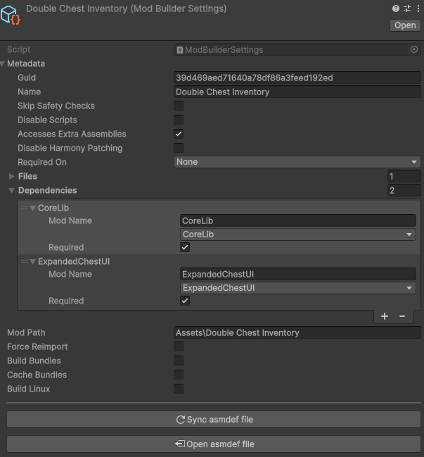
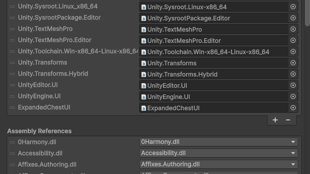
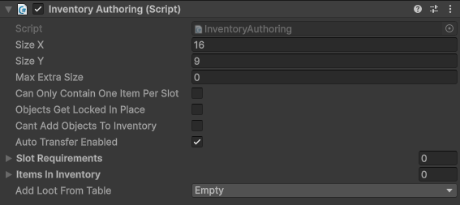
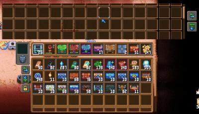

# ExpandedChestUI
This mod replaces the default Core Keeper Chest UI for a more expansive UI that allows for scrolling. **THIS MOD DOES NOTHING ON ITS OWN**, but is rather to help Modders more easily create larger chests. Up to 16x9 Inventory Size.

# What mods use this mod?
If you want to see this mod in action, check out these other mods!
- [Double Chest Inventory](https://mod.io/g/corekeeper/m/double-chest-inventory)
- [Chests Galore](https://mod.io/g/corekeeper/m/chests-galore)

# Usage
For those that wish to use this mod to create their own chests. Add the following code to your dependencies in your manifest.json file.
```json
"ck.modding.corelib": "https://github.com/CoreKeeperMods/CoreLib.git?path=/Assets/CoreLibPackage#4.0.0",
"ck.modding.expanded-chest-ui": "https://github.com/Minepatcher/ExpandedChestUI.git?path=/Assets/ExpandedChestUIPackage#0.3.0"
```

> **Warning:** This mod now requires CoreLib for modding, but is not required to be added as a dependency.

Then, add Expanded Chest UI to your Mod's _Mod Builder Setting_ in the project's root folder and press the `Sync asmdef file` button. This will update your asmdef file in your mod folder.





Everything else for creating your chest is the same as usual, but now you are allowed up to a 16x9 sized chest in the Inventory Authoring of your Chest Enitity Prefab.



ENJOY!!!


