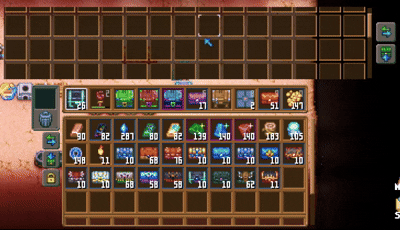

# ExpandedChestUI
Expanded Chest UI is a Core Keeper mod that expands the default Core Keeper Chest UI.

## What does this mod do?
- Adds four new buttons to the Chest UI based on [Quality of Core Keeper Mod](https://github.com/ReishyouSose/CoreKeeperMods/tree/1.0/Assets/CoreEnhance).
    - **_Split Stack_:** Split stacks into single items until the next slot is not empty.
    - **_Replenish_:** Moves already existing items in your inventory from this chest
	  to your inventory.
    - **_Store All_:** Stores all items in the inventory in the chest.
    - **_Take All_:** Takes all items from the chest into the inventory.
> **_Note:_** Store All and Take All both ignore the first row in your player inventory.
> 
> **_Note 2:_** Quick Stack, Replenish, Store All, and Take All ignore locked items.
- Adds Shortcut Keys for keyboard and controller for faster chest inventory usage:
  - **_Keyboard:_**
    - **Sort:** [R] <b>\*</b>Hover over chest UI to sort the chest, hover over player inventory to sort player inventory.
    - **Quick Sort:** [Q]
    - **Split Stack:** [Shift + R]
    - **Replenish:** [Shift + Q]
    - **Put All:** [CTRL + R]
    - **Take All:** [CTRL + Q]
  - **_Controller:_**
    - **Sort:** [RDpad] <b>\*</b>Select a chest element to sort chest, Select a player element to sort the player inventory.
    - **Quick Sort:** [LDpad]
    - **Split Stack:** [LT + RDpad]
    - **Replenish:** [LT + LDpad]
    - **Put All:** [RT + RDpad]
    - **Take All:** [RT + LDpad]
- Upgrades the default Chest Max Size to 16x9. This allows for chests with up to 144 slots with a scrollbar!
  (**_MODDERS ONLY_**)

## How do I Mod with Expanded Chest UI?
If you are a modder and want to create a custom chest. You can read the [wiki](https://github.com/Minepatcher/ExpandedChestUI/wiki) for more information.

## What mods use Expanded Chest UI?
Here's a list of mods that use Expanded Chest UI, check them out!
- [Double Chest Inventory](https://mod.io/g/corekeeper/m/double-chest-inventory)
- [Chests Galore](https://mod.io/g/corekeeper/m/chests-galore)

## Does this mod have controller support?
Yes! This mod has full controller support.

## Does this mod go in my server?
- Only if another mod requires it as a dependency, otherwise no. This mod is client-side only.
